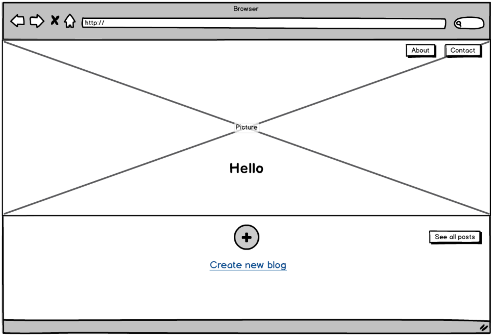
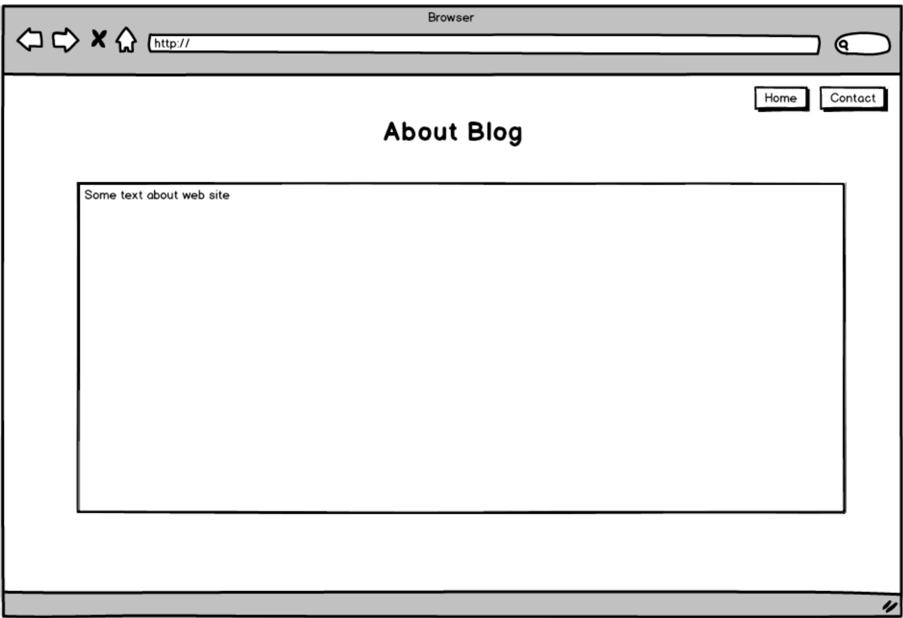
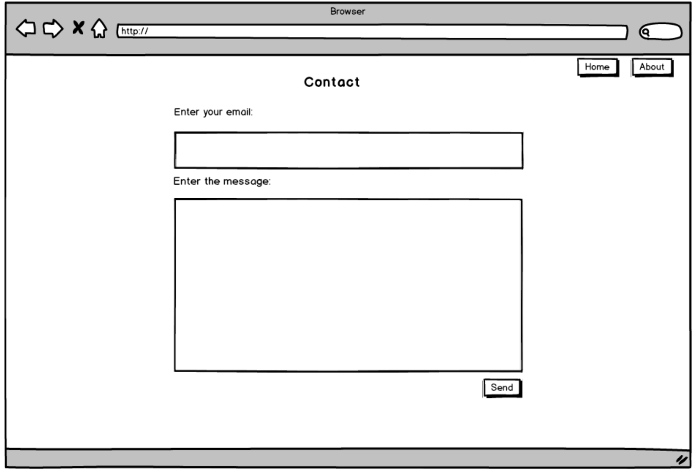

# Требования к проекту
### СОДЕРЖАНИЕ
  1.  [Введение.](#1)  
    1.1. [Назначение.](#1.1)  
    1.2. [Бизнес-требования.](#1.2)  
      1.2.1. [Исходные данные.](#1.2.1)  
      1.2.2. [Границы проекта.](#1.2.2)  
  2. [Требования пользователя.](#2)  
    2.1. [Программные интерфейсы.](#2.1)  
    2.2. [Интерфейс пользователя.](#2.2)  
    2.3. [Характеристики пользователей.](#2.3)  
    2.4. [Предположения и зависимости.](#2.4)  
  3. [Системные требования.](#3)  
    3.1. [Функциональные требования.](#3.1)  
    3.2. [Нефункциональные требования.](#3.2)  
      3.2.1. [Требования к внешним интерфейсам.](3.2.1)  
      3.2.2. [Ограничения.](3.2.2)  
      3.2.3. [Атрибуты качества.](3.2.3)  
      3.2.3.1. [Требования к удобству использования.](3.2.3.1)  
      3.2.3.2. [Требования к безопасности.](3.2.3.2)  
  4. [Аналоги.](#4)  
  
### 1. ВВЕДЕНИЕ 
#### 1.1 Назначение 

Веб-приложение "MyBlog" предназначено для людей, которые хотели бы вести публичный анонимный дневник, в котором бы они делились опытом с другими, писали о своей жизни или просто рассказывали о впечатлениях о каком-то значимом событии.

 #### 1.2 Бизнес-требования 
##### 1.2.1 Исходные данные 

Сегодня очень популярен такой вид деятельности, как блогинг. Люди часто делятся информацией о себе или о своем роде деятельности. Блоги с определенной тематикой помогают другим людям найти нужную для них информацию или просто узнать что-то новое о том или ином человеке. Поэтому возникла идея написать свое приложение, позволяющее заниматься блогерством

 ##### 1.2.2 Границы проекта 
 
Приложение позволяет пользователю создать собственный блог и выложить его на сайте, после чего его может посмотреть любой пользователь

 
 ### 2. ТРЕБОВАНИЯ ПОЛЬЗОВАТЕЛЯ 
#### 2.1 Программные интерфейсы 

В проекте используются такой фреймворк, как Flask, а также база данных Flask-SQLAlchemy.

 #### 2.2 Интерфейс пользователя 
 Пример графического интерфейса "MyBlog":

Основное окно
Здесь пользователь может создать новый блог и посмотреть уже написанные блоги, также узнать информацию о приложении и написать разработчику.

Окно "О приложении". 
Здесь можно увидеть информацию о приложении.

Окно "Все блоги". 
Здесь можно увидеть все загруженные блоги.

Здесь пользователь может отправить сообщение разработчику.

Окно "Создать блог". 
Здесь пользователь может создать новый блог, добавив в него текст и изображения.

Окно "Авторизация". 
Здесь пользователь может авторизироваться.

 #### 2.3 Характеристики пользователей 
 
Данное приложение будет интересно людям, которые хотели бы заниматься блогерством

 
 #### 2.4 Предположения и зависимости 
 Для работы с "MyBlog" требуется браузер и постоянное подключение к интренету. Подключение к интернету необходимо для того, чтобы пользователь мог отправлять http-запросы.
 
 ### 3. СИСТЕМНЫЕ ТРЕБОВАНИЯ 
#### 3.1 Функциональные требования 
Приложение предоставляет возможности:

1. Написание собственного блога.
2. Просмотр существующих блогов.
3. Просмотр информации о приложении.
4. Отправление сообщения разработчику

 #### 3.2 Нефункциональные требования 
 Наличие интернет-соединения.

##### 3.2.1 Требования к внешним интерфейсам 
"MyBlog" взаимодействует только с сервером Flask-SQLAlchemy, поэтому факторы, влияющие на работу приложения, сведены к минимуму.

##### 3.2.2 Ограничения 
Приложение не имеет ограничений в плане используемых технологий. Приложение будет разработано с помощью фреймворка Flask. Данные технологии выбраны ввиду их популярности на сегоднящний день.

##### 3.2.3 Атрибуты качества 

##### 3.2.3.1 Требования к удобству использования 
1. Корректное отображение запрашиваемой информации.
2. Понятный пользовательский интерфейс
 
 ##### 3.2.3.2 Требования к безопасности 
 Для написания собственного блога и просмотра других пользователь должен авторизироваться.

 ### 4. АНАЛОГИ 
 Аналогами данного проекта являются [Tumblr](https://www.tumblr.com), [Instagram](https://www.instagram.com). Данные приложения содержат большое количество информации, но в основном ориентированы на распространение изображений и прикрепленного к ним текста.
Основное отличие MyBlog от вышеописанных сайтов - это ориентация на текст, а не на прикрепленные изображения.
